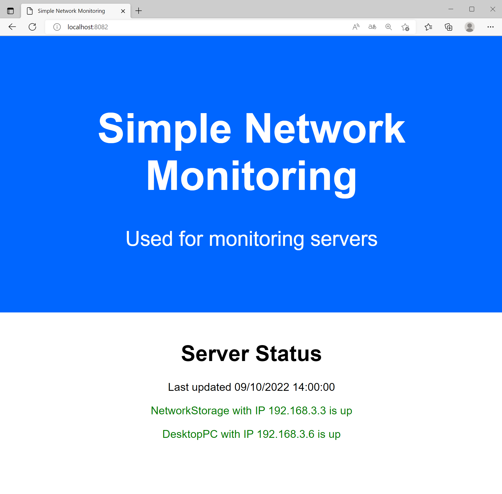
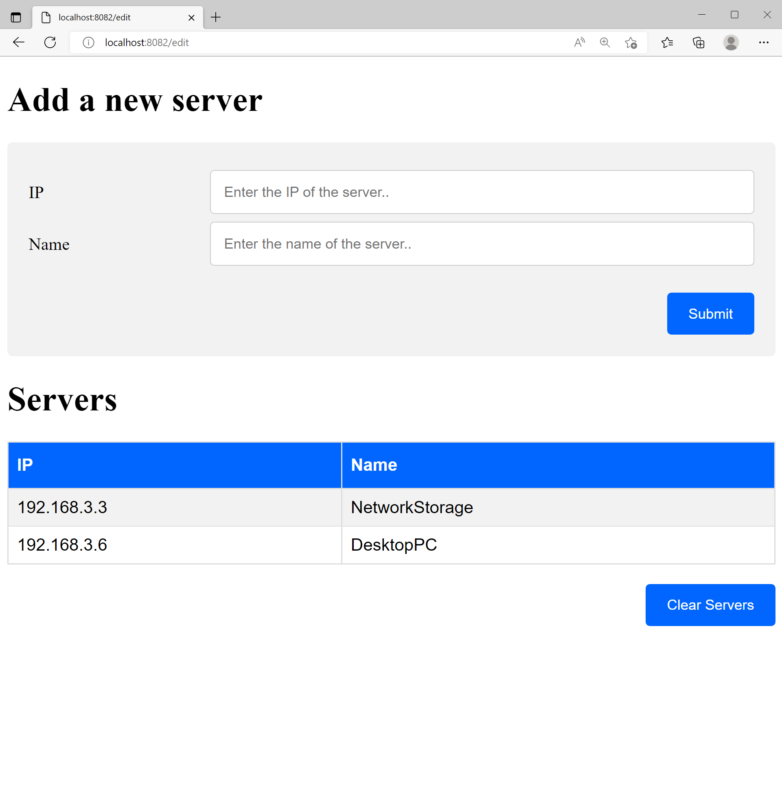

# PWSH-SimpleNetworkMonitorHTML
**This simple HTTP dashboard can ping servers, pc's and other network devices upon web request using a web browser, and show their current status**

## Requirements

**Windows**

Windows 10 or later

**Linux**

PWSH
[Link](https://learn.microsoft.com/en-us/powershell/scripting/install/installing-powershell-on-linux?view=powershell-7.2)

.DOT NET
[Link](https://learn.microsoft.com/en-us/dotnet/core/install/linux)

## How to use

Start pwsh (TIP: Win + X will show pwsh on a list to start quick)
```
cd '.\PathTo\Main'
.\Start-IPMonitorWebserver.ps1
```
### How to access

To view the dashboard
http://localhost:8082/

To Add servers
http://localhost:8082/edit

## Images



